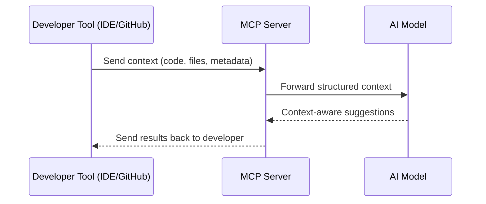

# Coaching for DevOps - Week 1

## Intro to DevOps & Branching Strategy

### Agenda

- Recap: Introduction to DevOps
- Case Study: Crowdstrike
- Demo: GitHub MCP Server
- Recap: Git Branching Strategies
- Exercise: Protect your branch!

---

## Introduction to DevOps

### What is DevOps?

> DevOps is the combination of cultural philosophies, practices, and tools that increases an organization’s ability to deliver applications and services at high velocity.

### Stages of DevOps

| Stage        | Description                                         | Common Tools                            |
| ------------ | --------------------------------------------------- | --------------------------------------- |
| **Planning** | Define goals, requirements, and roadmap.            | Jira, Trello, Azure Boards              |
| **Coding**   | Write application code and configuration files.     | VS Code, IntelliJ IDEA, Git             |
| **Build**    | Compile and package the application for deployment. | Maven, Gradle, npm, Webpack             |
| **Test**     | Validate functionality, performance, and security.  | JUnit, Selenium, Cypress, Postman       |
| **Release**  | Approve and prepare a version for deployment.       | GitHub Actions, Jenkins, GitLab CI/CD   |
| **Deploy**   | Push the application to target environments.        | ArgoCD, Spinnaker, AWS CodeDeploy       |
| **Operate**  | Run and maintain the application in production.     | Kubernetes, Docker, AWS ECS, Azure AKS  |
| **Monitor**  | Track performance, uptime, and issues.              | Prometheus, Grafana, Datadog, New Relic |

### Benefits of DevOps

- **Rapid Delivery:** More frequent releases and faster time-to-market.
- **Reliability:** Stable environments through integration testing and continuous monitoring.
- **Scale:** Efficient infrastructure and development process management.
- **Improved Collaboration:** Code review as part of CI/CD workflow.
- **Security:** Integrates security throughout the lifecycle (DevSecOps).

---

## Case Study: Crowdstrike

**Incident Date:** July 19, 2024
**Impact:** Faulty configuration update to CrowdStrike Falcon Sensor software caused BSOD on \~8.5 million Windows systems globally, affecting healthcare, aviation, and banking.
**Financial Losses:** \~\$10 billion
**Affected Systems:** Windows running Falcon Sensor v7.11+
**Cause:** Logic error in configuration file → Out-of-bounds memory read due to mismatch in expected vs actual input fields.

### Root Cause

1. **Input Mismatch:** Validator expected 20 fields; update provided 21.
2. **Testing Gaps:** Unit tests covered only happy paths; manual tests lacked invalid input coverage.
3. **Lack of Staggered Rollouts:** Deployed globally without phased rollout.
4. **Kernel-Level Risks:** Kernel-mode errors directly impacted system stability.

### Improvements by DevOps Stage

| Stage        | Improvement Suggestions                                                                                                             |
| ------------ | ----------------------------------------------------------------------------------------------------------------------------------- |
| **Planning** | Include rollback and phased rollout strategy in change management. Perform detailed risk assessments for kernel-level changes.      |
| **Coding**   | Apply stricter input validation and defensive coding. Conduct peer reviews focusing on configuration logic.                         |
| **Build**    | Automate static checks for configuration file integrity in the build pipeline.                                                      |
| **Test**     | Add edge case, invalid input, and backward compatibility testing. Include automated regression testing for kernel-level components. |
| **Release**  | Use gated releases with automated verification steps before approval.                                                               |
| **Deploy**   | Implement canary or blue-green deployments. First deploy to staging with production-like load testing.                              |
| **Operate**  | Introduce feature flags to quickly disable faulty updates. Maintain rapid rollback playbooks.                                       |
| **Monitor**  | Set up real-time monitoring for crash spikes post-deployment. Trigger automated rollback when thresholds are breached.              |

### Other Public Postmortem Reports for Learning

- [danluu/post-mortems](https://github.com/danluu/post-mortems)
- [snakescott/awesome-tech-postmortems](https://github.com/snakescott/awesome-tech-postmortems)
- [jimmyl02/awesome-postmortems](https://github.com/jimmyl02/awesome-postmortems)

---

## What is MCP?

The **Model Context Protocol (MCP)** is a protocol that enables development tools like IDEs and source control systems to interact with AI models in a structured way. It provides a standardized way to send and receive contextual information so the AI can provide better, context-aware responses.

### Key points:

- Acts as a bridge between development tools and AI.
- Allows passing project files, code, and metadata directly to the model.
- Helps AI provide more accurate and relevant suggestions.

#### MCP Interaction Flow (Mermaid Diagram)



---

## Class Activity: GitHub MCP Demo

Interact with the latest GitHub MCP server via chat and let AI do the magic.

---

## Git Branching Strategies

### Common Strategies

- **GitFlow**
- **Trunk-based**
- **GitHub Flow**

#### GitFlow

(Insert diagram here if available)

#### GitHub Flow

(Insert diagram here if available)

#### Trunk-based Development

(Insert diagram here if available)

---

## GitHub Demo: Best Practices

1. Branch protection
2. Code review
3. Status checks
4. Resolve merge conflicts

**Activity:** Setup branch protection rules yourself!

---

## Docker Installation

### Installation Options

- **Docker Desktop:** [docker.com/products/docker-desktop](https://www.docker.com/products/docker-desktop/)
- **Windows (Chocolatey):**

  ```sh
  choco install docker-desktop
  ```

- **Mac (Homebrew):**

  ```sh
  brew install --cask docker
  ```

---

## Activity: Advanced Git Commands

### Git Commands Cheat Sheet

| Command        | Description                                       |
| -------------- | ------------------------------------------------- |
| `git log`      | Show commit logs                                  |
| `git diff`     | Show changes between commits                      |
| `git fetch`    | Download objects and refs from another repository |
| `git pull`     | Fetch and integrate with local branch             |
| `git remote`   | Manage remote URLs                                |
| `git branch`   | List/create branches                              |
| `git checkout` | Switch branches                                   |
| `git merge`    | Merge changes between branches                    |
| `git tag`      | Create/list/delete tags                           |
| `git stash`    | Temporarily remove changes                        |
| `git rebase`   | Reapply commits on top of another base tip        |
| `git reset`    | Reset current branch to a specific state          |
| `git revert`   | Create a new commit to reverse changes            |
